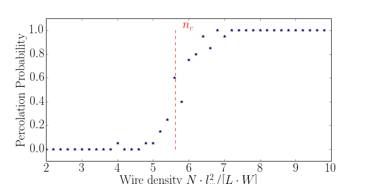
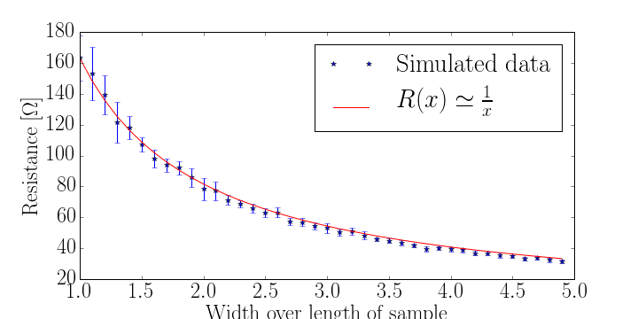

Workflow examples
==================================

Let's find out whether the simulation reproduces results from the litterature. In particular, let's look at the probability for the system to percolate, given a certain number of wires. This probability would depend on the sample size and the wire length, surely. Therefore, a scale-free characterization of the density, :math:`n`, of wires is, given a wire length :math:`l_w`, and sample length :math:`L`, width :math:`W`, and wire number :math:`N`

.. math::

    n = \frac{N}{L/l_w \cdot W/l_w} = \frac{Nl_w^2}{L\cdot W}

This scale free density, :math:`n` is the number of wires on average present in a square whose side is equal to a wire length. Therefore, finite-size effects apart, the probability :math:`P(n)` for the system to percolate at a density :math:`n` of wires is now a sample-size / wire-size free measurement.

The article: http://arxiv.org/pdf/1110.0629.pdf finds the critical scale-free density of wires at which the percolation happens to be n=5.63

   >>> import numpy as np
   >>> import resistor_exercise as res_exercise

   >>> variable_wire_num = np.arange(200,1000,20) # n between 2 and 10 in this case.
   >>> sample_length = 50. #microns
   >>> sample_width = 50. #microns
   >>> wire_length=5. #microns
   >>> number_of_repetitions = 20

   >>> simulated_data = np.zeros( (number_of_repetitions,len(variable_wire_num)) ) #vertically for repetitions, horizontally for different wire numbers
   >>> for i in range(number_of_repetitions):
   >>>     for index,nwires in enumerate(variable_wire_num):
   >>>         sample=res_exercise.Sample(sample_length,sample_width,nwires,wire_length)
   >>>         tu,p_idx,percolates=sample.measure_percolation()
   >>>         if percolates==True:
   >>>             simulated_data[i,index]=1

   >>> import matplotlib.pyplot as plt #for plotting
   >>> import matplotlib as mpl
   >>> mpl.rcParams.update({'text.usetex':True, 'font.size':24.0, 'font.family': 'serif', 'font.serif': ['Computer Modern']})
   #nice plots
   >>> fig = plt.figure(figsize=(10 ,5))
   >>> plt.plot(variable_wire_num*wire_length*wire_length/sample_length/sample_width,np.mean(simulated_data,0),'*')
   >>> plt.ylim(-0.1,1.1)
   >>> plt.ylabel('Percolation Probability')
   >>> plt.xlabel(r'Wire density $N\cdot l_w^2/[L\cdot W]$')
   >>> plt.savefig(results_folder_path+'Percolation.png')
   >>> plt.vlines(5.63,0,1,color='r',linestyle='dashed')
   >>> plt.text(5.83,1.0,r'$n_c$',color='r')

Making the workflow better (Optional).
-----------------------------

Let's say we simulated the results, which could take a long time, and we go drink a coffee and the computer shuts down, but we do not want to exceed more than 10 hours on this bonus exercise so it is really annoying to simulate everything again.

We need to :

* Define a working folder in which to store the results
* Make sure we do not erase this folder / create a new folder every time at startup
* Save the results of the simulations into some file format
* Check everytime whether the saved result already exists in the results' folder
* If it doesn't exist, run the simulations. If it does exist, skip the simulation and load the result from the saved file.

**Preamble** :
   >>> #core packages
   >>> import numpy as np
   >>> import resistor_exercise as res_exercise
   >>> # for plotting
   >>> import matplotlib.pyplot as plt
   >>> import matplotlib as mpl
   >>> # os, i/o
   >>> import pickle
   >>> import os
   >>> # to display the plots inside of the notebook
   >>> %matplotlib inline
   >>> # nice plots
   >>> mpl.rcParams.update({'font.size':24.0, 'font.family': 'serif', 'font.serif': ['Computer Modern']})
   >>> current_working_directory = os.getcwd()
   >>> results_directory_path = current_working_directory + '/results/'
   >>> if not os.path.exists(results_directory_path):
   >>>     # create a results directory in the directory where this notebook is located, except if it already exists
   >>>     os.mkdir(results_directory_path)

At this point we have created a results folder in the current folder (the folder where the notebook is located). This folder is only created if it does not exist.

**Window for executing the simulation**:
   >>> #Window of execution
   >>> # Window of execution
   >>> name_of_the_experiment = 'percolation_curve'
   >>> #Data will be stored into a file with that name
   >>> output_file_name = results_directory_path + name_of_the_experiment + '.pkl'

   >>> variable_wire_num = np.arange(200,1000,20)
   >>> sample_length = 50. #microns
   >>> sample_width = 50. #microns
   >>> wire_length=5. #microns
   >>> number_of_repetitions = 20

   >>> if not os.path.exists(output_stocker_name):
   >>>     #simulation starts
   >>>     simulated_data = np.zeros( (number_of_repetitions,len(variable_wire_num)) ) #vertically for repetitions, horizontally for different wire numbers

   >>>     for i in range(number_of_repetitions):
   >>>         for index,nwires in enumerate(variable_wire_num):
   >>>             sample=res_exercise.Sample(sample_length,sample_width,nwires,wire_length)
   >>>             _,p_idx,percolates=sample.measure_percolation()
   >>>             if percolates==True:
   >>>                 simulated_data[i,index]=1

   >>>     with open(output_file_name, 'w') as output_file: # opens the file in write mode.
   >>>         pickle.dump(simulated_data, output_file)

   >>> else:
   >>>     with open(output_file_name) as output_file:
   >>>     #we simply read the data we have already computed.
   >>>         simulated_data = pickle.load(output_file)

We give this *experiment* a name to be able to track the data better. We then create the path where to save the table, which is a in convenient file format. Then, the same definitions follow. After, we execute the simulation block only if the saved file doesn't exist yet (the simulation was never performed). After the simulation is done, the simulation data is stored into the file and saved into its defined location. Next time we execute this window, the saved file would exist, the simulation would be skipped, and the simulation data would be directly loaded from saved data.

**Window for plotting**
   >>> #Window for plotting
   >>> fig = plt.figure(figsize=(10 ,5))
   >>> plt.plot(variable_wire_num*wire_length*wire_length/sample_length/sample_width,np.mean(simulated_data,0),'*')
   >>> plt.ylim(-0.1,1.1)
   >>> plt.ylabel('Percolation Probability')
   >>> plt.xlabel(r'Wire density $N\cdot l_w^2/[L\cdot W]$')
   >>> plt.vlines(5.63,0,1,color='r',linestyle='dashed')
   >>> plt.text(5.83,1.0,r'$n_c$',color='r')
   >>> plt.savefig(results_folder_path+'Percolation.png')

Another example: varying the aspect ratio
------------------------------

Let's investigate a system with a density higher than the percolation threshold. Then, the width of the sample is veried between 1 to 5 sample lengths while keeping the wire *density* constant.

One can take the previous workflow, change the name of the experiment, change a bit the simulation part, and that's it.

**Window of execution**
   >>> #Window of execution
   >>> name_of_the_experiment = 'resistance_aspect_ratio'
   >>> output_file_name = results_directory_path+name_of_the_experiment+'.pkl'

   >>> variable_wire_num = np.arange(1000,5000,100)
   >>> sample_length = 50. #microns
   >>> variable_sample_width = 50.*np.arange(1,5,.1) #microns
   >>> wire_length=5. #microns
   >>> number_of_repetitions = 10
   >>> linear_res=1.59 #value for silver
   >>> contact_res=100. #Ohm

   >>> if not os.path.exists(output_file_name):

   >>>     simulated_data = np.zeros( (number_of_repetitions,len(variable_wire_num)) ) #vertically for repetitions, horizontally for different wire numbers

   >>>     for i in range(number_of_repetitions):
   >>>         for index,sampwidth in enumerate(variable_sample_width):
   >>>             #we need to increase the wire density so that the overall density stays the same
   >>>             sample=res_exercise.Sample(sample_length,sampwidth,variable_wire_num[index],wire_length)
   >>>             try:
   >>>             #might not percolate all the time..
   >>>                 sample.calculate_res_system(linear_res,0.03,contact_res)
   >>>                 simulated_data[i,index]=sample.res_system
   >>>             except:
   >>>                  continue

   >>>     with open(output_file_name, 'w') as output_file: # opens the file in write mode.
   >>>         pickle.dump(simulated_data, output_file)
   >>> else:
   >>>     with open(output_file_name) as output_file:
   >>>     #we simply read the data we have already computed.
   >>>     simulated_data = pickle.load(output_file)

**Window of Plotting**
   >>> #fitting the data
   >>> from scipy import optimize

   >>> x_axis = variable_sample_width/sample_length
   >>> y_axis = np.mean(simulated_data,0)

   >>> fitfunc = lambda p, x: p[0]*x**(p[1]) #a 1/x function
   >>> errfunc = lambda p, x, y: abs(fitfunc(p, x) -y) # Distance to the target function

   >>> p0 = [y_axis[0],-1.] #initial guess of the parameters
   >>> p1, success = optimize.leastsq(errfunc, p0[:], args=(x_axis,y_axis)) #solved least squares
   >>>
   >>> #plotting the data
   >>> fig=plt.figure(figsize=(10,5))
   >>> plt.errorbar(variable_sample_width/sample_length,np.mean(simulated_data,0),np.std(simulated_data,0),marker='*',linestyle='None')
   >>>
   >>> plt.plot(x_axis,fitfunc(p1,x_axis),color='r')
   >>> plt.xlabel('Width over length of sample')
   >>> plt.ylabel(r'Resistance $[\Omega]$')
   >>> plt.legend(['Simulated data',r'$R(x)\simeq \frac{1}{x}$'])
   >>> plt.savefig(results_directory_path+'Resistance_in_aspect_ratio.png')

What do you think, does this result **make sense** ?