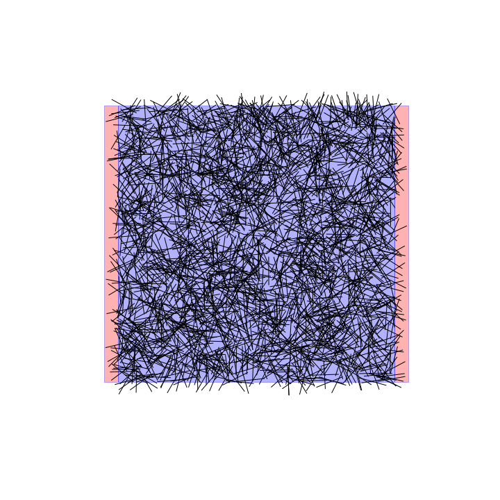

Functions
==================================

All the functions and objects that are needed to start the simulations are contained in the res_exercise.py file. This needs to be imported at the beginning of your notebook so that you can use the following definitions.

:class:`Sample` is an *object* in Python. It is more than a function, because you can give it *attributes*. These are parameters that are stored in the *object*, that you can access at any time. The Sample object has the following attributes

* a length (current flow axis) in :math:`\mu m`
* a width in :math:`\mu m`
* the number of nanowires
* length of the wires in :math:`\mu m`
* a list of the endpoints of all the wires

Let's create a sample.

   >>> import numpy as np  #this is for handling floats efficiently
   >>> import resistor_exercise as resex #the .py file containing all the definitions of this problem

   >>> number_of_wires = 2500
   >>> sample_length = 50. #the point means it will be stored as float, not an int
   >>> sample_width = 50.
   >>> wire_length = 5.

   >>> sample=resex.Sample(sample_length,sample_width,number_of_wires,wire_length)

**resex** gives you access to all the definitions inside res_exercise.py. Inside is a class definition, :class:`Sample` which you can initialize with the 4 parameters above. This creates a Sample object, stored now in a variable with the name sample (could be called jxchsdg, but it is better to be explicit).

You can read all the attributes that are inside the object now

   >>> sample.length,sample.width,sample.wire_length,sample.num_wires
   >>> (50.0, 50.0, 5.0, 2500)

   >>> sample.wire_list
   >>> array([[ 30.32970707,  10.11090525,  26.05764485,  12.70888223],
              [ 10.55096734,   2.75473903,   5.80341127,   4.32340451],
              [ 36.54826468,  32.28029196,  40.67108392,  35.10913653],
              ...,
              [ 26.57784435,   4.29026876,  26.63457788,   9.28994688],
              [ 26.93577222,  13.64105079,  22.86427251,  16.54327237],
              [ 46.35783415,  44.20297715,  44.62074911,  48.89153082]])

The center points of the wires are simply distributed within the bounds of the sample, and than a segment of the length of the wire is rotated by a random angle around the center points.

The object has inbuilt methods to perform measurements on it, show it, etc.

:class:`Sample.plot_sample()` plots the sample quite simply. To make sure that it gets plotted, and plotted inside your notebook, you need to import matplotlib.pyplot and make it inline

   >>> import matplotlib.pyplot as plt
   >>> %matplotlib inline
   >>> sample.plot_sample()

which shows the electrode pads in red, the supposed stretchable matrix in blue, and the wires in black. Notice that a method is called with parentheses ().

:class:`Sample.t_and_u()` calculates the relative positions of all the cuts along every wire to know who is connected to whom, and how long the wire bits are. The *t* (and *u*) variable is the parameters interpolating the wires as :math:`\vec{A} + t(\vec{B}-\vec{A})` with :math:`t \in [0,1]`, and :math:`\vec{A},\vec{B}` are the beginning and end points of a wire. The details are can be found here: http://stackoverflow.com/questions/563198/how-do-you-detect-where-two-line-segments-intersect

It is calculated in such a way that all negative entries mean there are no intersections. All the positive entries (which can only be between 0 and 1) are there where the wires get cut.

   >>> tu_matrix = sample.t_and_u()
   >>> who_cuts_wire_n5=np.where(tu_matrix[5,:]>0)
   >>> who_cuts_wire_n5
   >>> (array([  51,  142,  185,  362,  437,  506,  537,  558,  567,  639, 1023,
            1352, 1432, 1856, 1989, 2059, 2163, 2221, 2238, 2240, 2246, 2381,
            2412]),) #these are the wires, in the wire_list, which cut wire number 5

   >>> how_many_times = np.sum(tu_matrix[5,:]>0) #or len(who_cuts_wire_n5[0])
   >>> how_many_times
   >>> 23

:class:`Sample.measure_percolation()` checks whether there is a wire path running from the left electrode to the right electrode (i.e, the system *percolates*). If this is not the case, then the sample is not conducting. It returns a triplet of output : the t_and_u matrix, the index of all the wires participating in the percolation, and binary percolation answer (0 if not, 1 if yes).

   >>> tu_matrix, percolating_wire_indices, percolate = sample.measure_percolation()
   >>> percolate
   >>> True

:class:`Sample.calculate_res_system(linear_res,wire_width,contact_res)` calculates the equivalent resistance of the system for a given wire linear resistance, wire radius and contact resistance. All values are in units of micrometer. This function does not return anything. It updates the state of the object and gives it an attribute, res_system.

   >>> sample.calculate_res_system(1.59,0.03,10000)
   >>> sample.res_system
   >>> 1058.3

