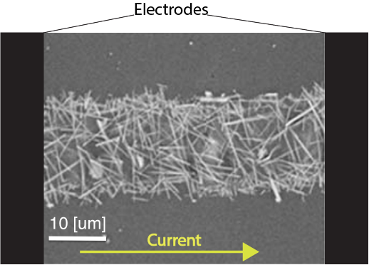
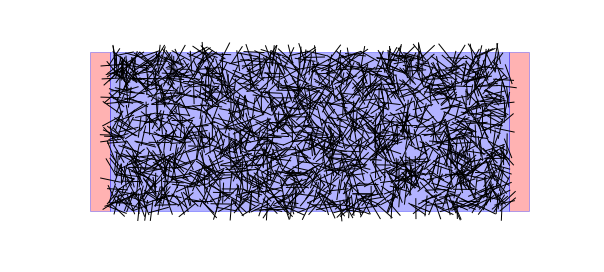

.. sphinx documentation master file, created by
   sphinx-quickstart on Mon Feb  8 17:49:19 2016.
   You can adapt this file completely to your liking, but it should at least
   contain the root `toctree` directive.

Stretchable electronics
==================================

**Welcome** to the bonus Python programming exercise about stretchable electronics!

Stretchable electronics is a booming field in material engineering.

This exercise deals with investigating a promising system for a stretchable strain sensor.

*Jump to*:

.. toctree::
   :maxdepth: 2

   installation
   functions
   examples_of_worfklow
   list_of_tasks

Problem Statement
==================================

Given a number :math:`N` of randomly distributed conductive sticks of resistivity :math:`\rho`, with interstick contact resistance :math:`C`, find the equivalent resistance :math:`R_{eq}` of the system organized in a 2D busbar geometry. In particular, we are interested in investigating the behavior of such a system in terms of the density of wires per square, and in function of the strain put on the bus axis

The first image is that of an array of silver nanowires of 10 microns in length. The second image is the simulated equivalent of the system.

Solving the problem
==================================

Let's take a look at a couple wires within the network.

The wire intersections consistute the contact resistances. The length of the wire bit between two contacts is a resistance of the magnitude of :math:`\rho\cdot l`, where :math:`l` is the length of the wire bit, and :math:`\rho` is the linear resistivity. In an equivalent resistor network picture, the system looks like the following

Now how do we compute the equivalent resistance of the whole network ? There are many ways to do it, but we need to make a choice. In this case, we chose to say that the current entering at the left electrode is 1 Ampères, and so is the exiting current (obviously). Then, the voltage drop accross the sample is going to yield the equivalent resistance, since from Ohm's Law:

.. math::

   U_{drop} = R_{eq}\cdot I \equiv R_{eq}

Every black dot (node) on the figure above as attributed a potential :math:`u_i`. If we can find all the potentials at all the nodes, we can find in particular the potential on the left and the right electrode, and from there calculate the voltage drop. In order to find this, we need the law that is obeyed by this system. The set of laws are the Kirchhoff laws, and in particular the conservation of current in the system.

At every node there is as much current entering as there is current leaving. Therefore,

.. math::
   \sum \limits_{j=in-out} I_{j} & = 0 \\
   \sum \limits_{j=n_i} \frac{u_i - u_j}{R_{ij}} & = 0

where :math:`n_i` is the set of neighbors of node :math:`u_i`. The above set of equations is valid unless the node considered is the electrode, in which case the sum of currents is either -1 (left electrode) or 1 (right electrode). This is a system of :math:`N` linear equations (every distinct i constitutes one equation), with :math:`N` the number of nodes, that can be written in matrix form as follows, given that :math:`\vec{u} := \left(u_0,u_1,\ldots,u_N\right)`, :math:`G_{ij} = \frac{1}{R_{ij}}` if :math:`i\neq j` and :math:`G_{ii} = \sum \limits_{j=n_i}\frac{1}{R_{ij}}` and :math:`C=\left(0,\ldots,\underbrace{-1}_{\text{left electrode}},\ldots,\underbrace{1}_{\text{right electrode}},\ldots,0\right)`

.. math::
   G\cdot \vec{u}^T = C

But at this point :math:`G` is not invertible because the system of equations is redundant. Indeed, the inversion of the system of equations means that there is one unique value for every one of the potential nodes that solves the problem. But this is not true. We can choose all the potentials up to a constant factor, since it is the potential *drop* that matters. It doesn't matter if the left and right electrodes are at 0V and 5V, or 12V and 17V. The physics stays the same. To lift this degeneracy, we introduce the choice of :math:`u_{i=\text{left}} = 0`, which means that the left electrode is grounded. This reduces the number of linear equations by 1, and now the potential on the right electrode is the equivalent resistance (since the voltage drop accross the sample is now the voltage on the right electrode). Therefore, the solution to the problem is

.. math::
   R_{eq} = \left[G^{-1}\cdot C\right]_{i=\text{right}}

So the whole problem reduces to

* Find all the intersections between all the sticks
* Attribute potential nodes at every end of the resistors (contacts and bits)
* Extract from the intersection data which node is connected to which other node and by what resistance
* Create the :math:`G` matrix and solve the linear problem
* The equivalent resistance is the potential on the right electrode

Indices and tables
==================

* :ref:`genindex`
* :ref:`modindex`
* :ref:`search`

