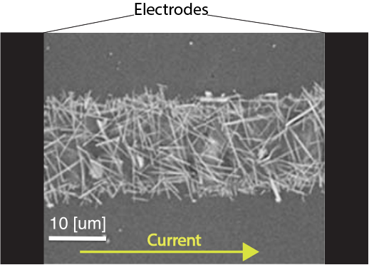
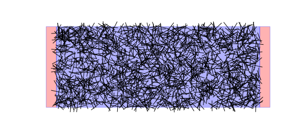

Problem Statement
==================================

Given a number :math:`N` of randomly distributed conductive sticks of resistivity :math:`\rho`, with interstick contact resistance :math:`C`, find the equivalent resistance :math:`R_{eq}` of the system organized in a 2D busbar geometry. In particular, we are interested in investigating the behavior of such a system in terms of the density of wires per square, and in function of the strain put on the bus axis

The first image is that of an array of silver nanowires of 10 microns in length. The second image is the simulated equivalent of the system.